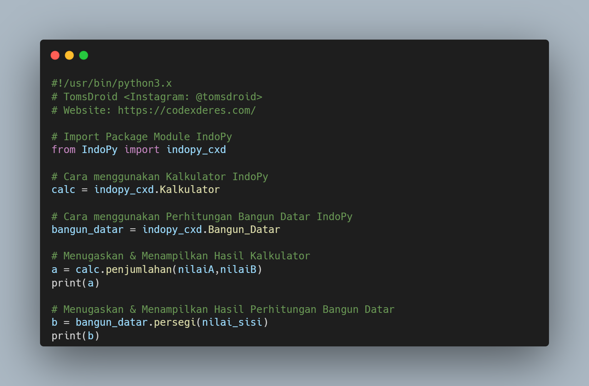

              

# INDOPY ~ CodeXDeres
IndoPy adalah Packages Module Python berbahasa Indonesia yang saat ini baru berencana untuk merancang module pembelajaran Indonesia semakin meningkat.

Didalam Package Module ini terdapat berbagai macam Class & Fungsi berbahasa indonesia yang mudah dimengerti serta dipahami oleh pemula sekalipun.

Class & Fungsi IndoPy yang tersedia saat ini:
1. Kalkulator Sederhana
2. Perhitungan Bangun Datar

Jika kamu ingin menggunakan Library IndoPy silahkan install via PyPi
```python
> pip install IndoPy==1.0.0
```
atau bisa juga install via Terminal / CMD
```bash
> git clone https://github.com/codexderes/indopy
```

## Features IndoPy Module
- [x] Kalkulator Sederhana
- [x] Perhitungan Bangun Datar

## Cara penggunaan Package Module IndoPy

